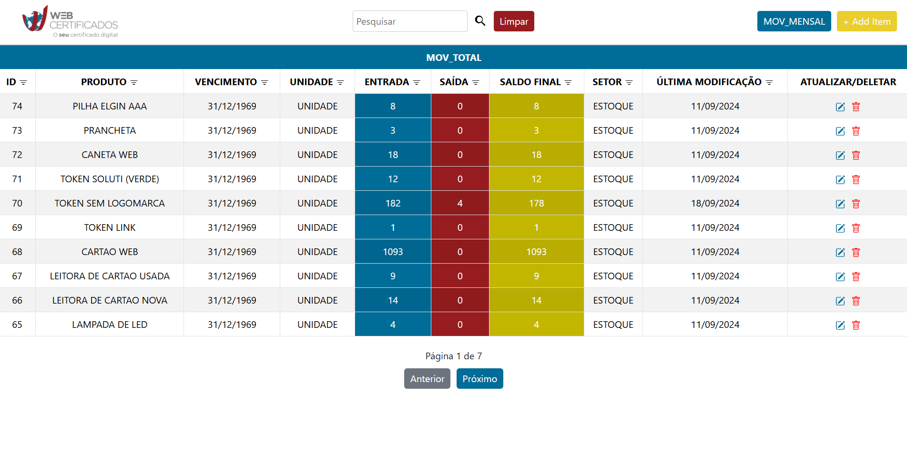
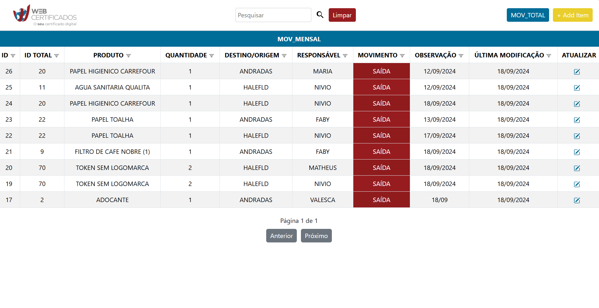
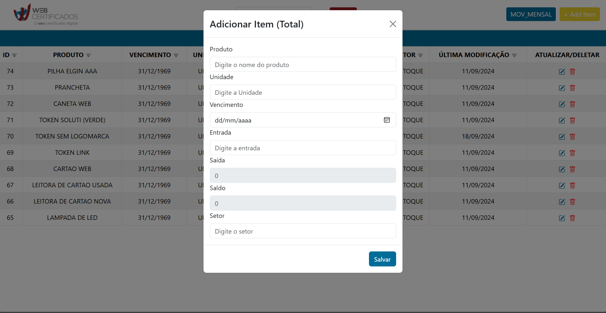
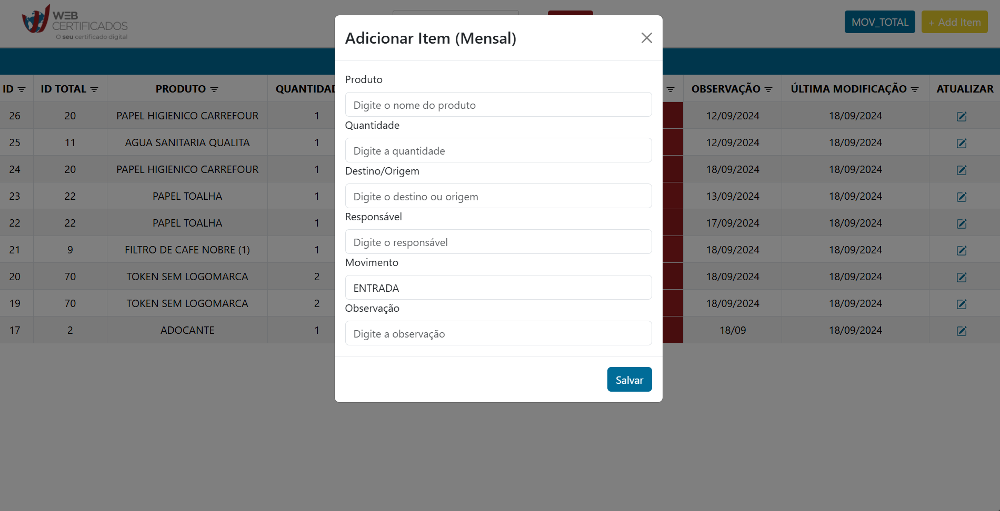
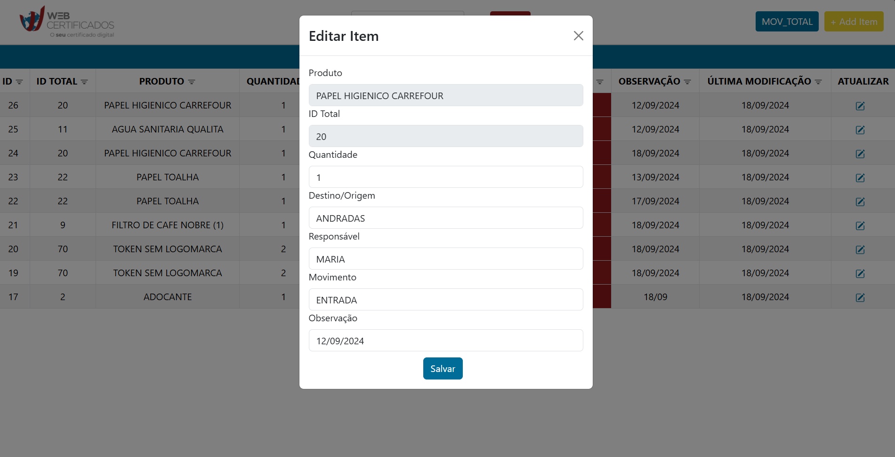

# 📊 Project-Financial-Stock

**Project-Financial-Stock** é um sistema de gerenciamento de estoque financeiro desenvolvido para a empresa **WebCertificados**. O projeto foi construído utilizando **TypeScript** para garantir maior segurança no código e **React** para facilitar a construção da interface do usuário.

Este sistema foca no controle de estoque, com duas tabelas: **Tabela Total** e **Tabela Mensal**, permitindo a adição, atualização e sincronização de itens entre ambas as tabelas.

## 🛠️ Funcionalidades

- **Adicionar itens na Tabela Total**: Todos os novos itens devem ser primeiramente adicionados na **Tabela Total**.
- **Atualizar itens**: Modifique as informações dos itens tanto na **Tabela Total** quanto na **Tabela Mensal**.
- **Remover itens**: Ao remover um item da **Tabela Total**, ele será automaticamente removido da **Tabela Mensal**, caso esteja presente.
- **Adicionar itens à Tabela Mensal**: Itens já presentes na **Tabela Total** podem ser adicionados à **Tabela Mensal** com a aplicação de um movimento (entrada ou saída).
- **Adicionar o mesmo item com movimentos diferentes**: Um mesmo item pode ser adicionado várias vezes à **Tabela Mensal** com diferentes movimentos de estoque (entrada ou saída).
- **Sincronização de tabelas**: Alterações na **Tabela Total** (adições, remoções ou atualizações) refletem automaticamente na **Tabela Mensal**.
- **Atualização de quantidade**: A quantidade dos itens na **Tabela Mensal**, referente aos movimentos de entrada e saída, atualiza automaticamente a quantidade do mesmo item na **Tabela Total**.

---

## 🚀 Tecnologias Utilizadas

- **TypeScript** - Para maior segurança e tipagem estática no desenvolvimento.
- **React.js** - Interface dinâmica e reativa.
- **React Bootstrap** - Estilização e componentes prontos para uma interface responsiva.
- **CSS Modules** - Estilos encapsulados por componente.
- **Banco de Dados SQL** - Para armazenamento e gerenciamento das informações de estoque.
- **[API RESTful]** - Comunicação e persistência de dados com o backend.

---

## 📋 Como Usar

### 1. Adicionando Itens na Tabela Total

1. Navegue até a seção **Tabela Total**.
2. Clique no botão **Adicionar Item** na barra de navegação.
3. Preencha o formulário com as informações do novo item (nome, quantidade, preço).
4. Clique em **Salvar** para adicionar o item à tabela.

### 2. Atualizando Itens

1. Em qualquer uma das tabelas, clique no ícone de **editar** ao lado do item que deseja modificar.
2. Altere os dados conforme necessário.
3. Clique em **Salvar** para confirmar as alterações.

### 3. Removendo Itens (Sincronização Automática)

1. Na **Tabela Total**, clique no ícone de **remover** ao lado do item.
2. Se o item estiver presente na **Tabela Mensal**, ele será removido automaticamente.

### 4. Gerenciando Itens na Tabela Mensal

1. Adicione itens da **Tabela Total** à **Tabela Mensal**.
2. Escolha o movimento a ser aplicado (**entrada** ou **saída**).
3. Um mesmo item pode ser adicionado várias vezes à **Tabela Mensal** com diferentes movimentos.
4. A quantidade dos itens na **Tabela Mensal**, com base nas entradas e saídas, atualiza automaticamente a quantidade correspondente na **Tabela Total**.

---

## 📸 Exemplo do Projeto

### Tabela Total

### Tabela Mensal

### Modal Tabela Total

### Modal Tabela Mensal

### Modal Editor Tabela Total

### Modal Editor Tabela Mensal

---
